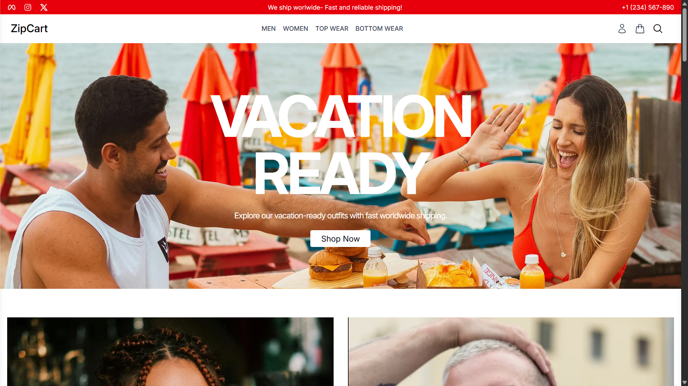
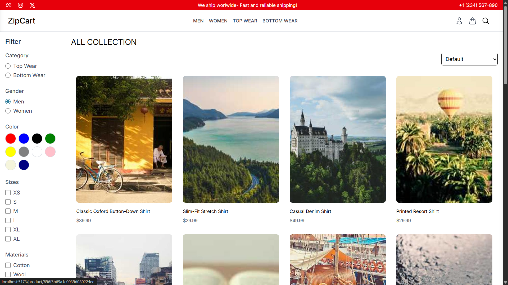
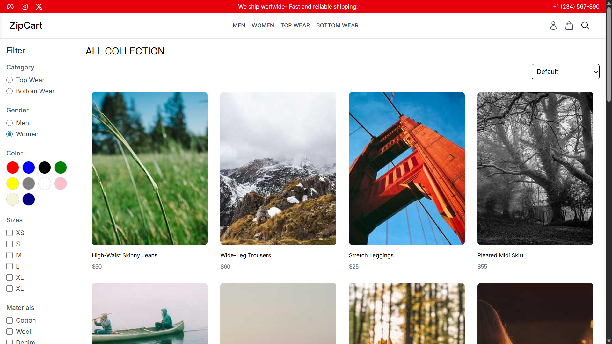

# 🛒 ZipCart – Full Stack E-Commerce Application

ZipCart is a full-stack MERN (MongoDB, Express, React, Node.js) e-commerce application featuring user authentication, admin management, shopping cart, orders, and guest checkout support.

---

##  Features

### Authentication & Authorization
- User registration & login (JWT based)
- Role-based access (User / Admin)
- Protected routes (Frontend & Backend)
- Persistent login using localStorage
- Guest user support with unique guest ID

###  Shopping Experience
- Browse products by category & gender
- Add to cart (Guest & Logged-in users)
- Update cart items (quantity, size, color)
- Merge guest cart on login
- Checkout flow

###  Orders
- Place orders
- View user orders
- View order details
- Admin order management

###  Admin Panel
- Admin dashboard
- Product management
- Order management
- User management
- Role-based route protection

---

##  Tech Stack

### Frontend
- React (Vite)
- Redux Toolkit
- React Router DOM
- Tailwind CSS
- Axios

### Backend
- Node.js
- Express.js
- MongoDB
- Mongoose
- JWT Authentication
- bcryptjs

---

##  Project Structure
ZipCart/
├── backend/
│ ├── config/
│ ├── controllers/
│ ├── data/
│ ├── middleware/
│ ├── model/
│ ├── routes/
│ ├── seeder.js
│ └── server.js
│
├── frontend/
│ ├── src/
│ │ ├── assets/
│ │ ├── components/
│ │ ├── pages/
│ │ ├── redux/
│ │ └── App.jsx
|
├── assets/
|
└── README.md

##  Screenshots

| Hero | Men Collection | Women Collection |
|------|----------------|------------------|
|  |  |  |

## Author
Sahil Thikekar